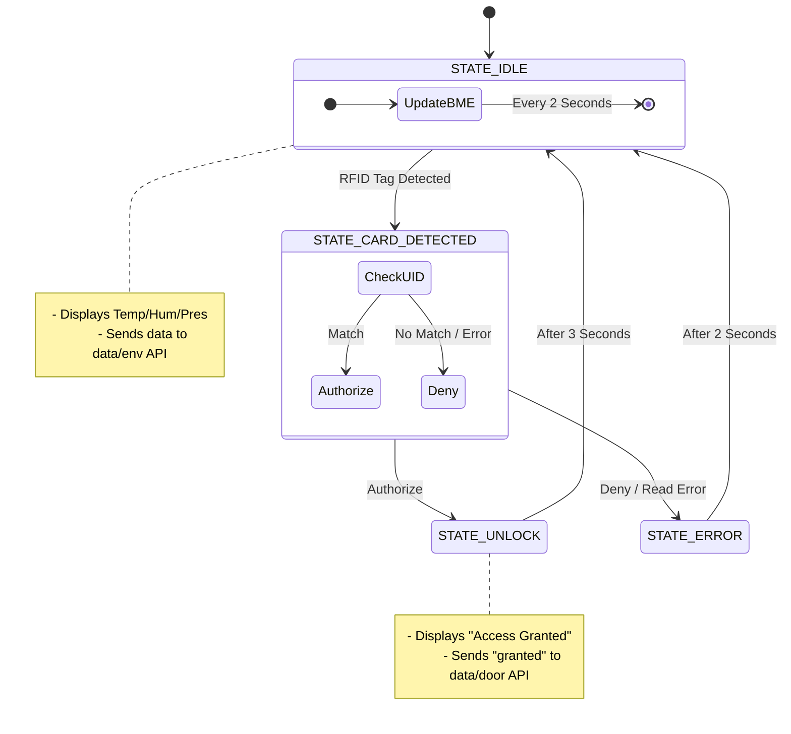

# ESP32 Smart Access & Environment Monitor

An IoT-based security system that monitors environmental conditions (BME280) and manages door access via RFID, reporting all data to a Go-based backend server.

## System Logic Flow

The system operates using a Finite State Machine (FSM) to handle non-blocking transitions between environmental monitoring and security access.



## Wiring Overview

The system utilizes both SPI and I2C communication protocols. Below is the pin mapping used in `config.h`.

### MFRC522 (SPI)
| Pin | ESP32 GPIO |
| :--- | :--- |
| **RST** | 27 |
| **SDA (SS)** | 5 |
| **SCK** | 18 |
| **MISO** | 19 |
| **MOSI** | 23 |

### I2C LCD
| Pin | ESP32 GPIO |
| :--- | :--- |
| **SDA** | 21 |
| **SCL** | 22 |

---

## Configuration

All hardware settings and network credentials are managed in `config.h`. Before compiling, ensure you update the following:

1. **Network Credentials**: Update `WIFI_SSID` and `WIFI_PASS` to match your local network.
2. **API Endpoints**: Ensure `API_ENV_ENDPOINT` and `API_DOOR_ENDPOINT` point to your local server IP address.
3. **Authentication**: Update the `AUTHORIZED_UID` byte array to match the UID of your specific RFID tag.
4. **Security**: Replace the placeholder `API_KEY` with your actual server authorization token.

./include/config.h
```c
const uint8_t AUTHORIZED_UID[4] = {0x35, 0x85, 0x4E, 0x06};
#define WIFI_SSID "Pruek"
#define WIFI_PASS "065xxxxxxxxxxxx"
#define API_ENV_ENDPOINT  "http://192.168.1.75:3000/data/environment"
#define API_DOOR_ENDPOINT "http://192.168.1.75:3000/data/door"
#define API_KEY "xxxxxxxxxxxxxxxxxxxxx"
```

## Usage

1. Open the project in the Arduino IDE or PlatformIO.
2. Configure your `config.h` file.
3. Upload the sketch to your ESP32.
4. Open the **Serial Monitor** at a baud rate of `115200` to view system logs and debug information.
5. Present an authorized RFID tag to the reader to trigger the access logic.